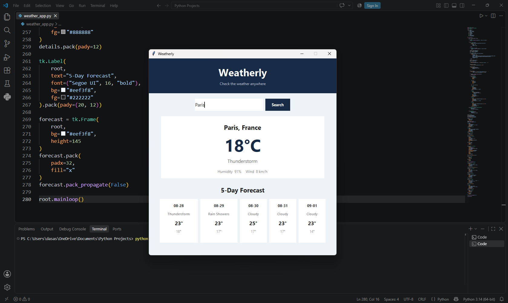

# Weatherly 🌤️

A simple and lightweight **weather application built with Python** using the **OpenWeather API**.

Weatherly lets you quickly check the current weather conditions of any location through a clean and beginner-friendly interface.

## 📸 Screenshot Preview



## ✨ Features

* 🌍 Search weather by location
* 🌡️ View current temperature
* ☁️ Check weather conditions
* 💧 View humidity
* 💨 View wind speed
* 🌤️ Weather condition descriptions
* 🖥️ Simple and clean interface
* 🔗 Powered by OpenWeather API

## 🛠️ Built With

* **Python**
* **Tkinter**
* **OpenWeather API**
* **Requests**

## 🚀 How to Run

1. Clone the repository:

```bash
git clone https://github.com/CodedMystic/Weatherly.git
```

2. Open the project folder:

```bash
cd Weatherly
```

3. Install the required package:

```bash
pip install requests
```

4. Run the application:

```bash
python weather_app.py
```

⭐ If you like Weatherly, consider giving the repository a star!
